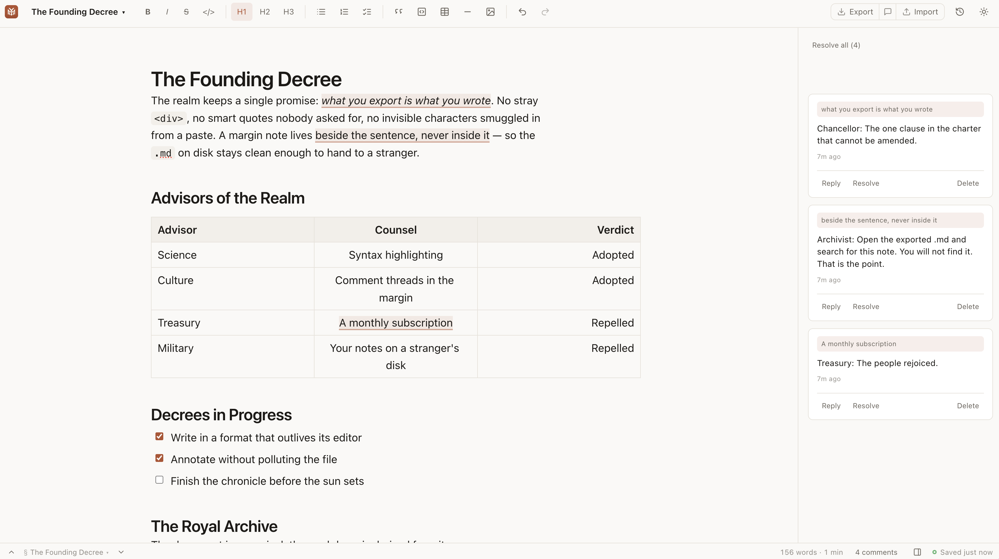

<div align="center">


<h1>Yiannis Mertzanis' Markdown</h1>

<p>
  <strong>An offline-first, installable markdown editor with inline comments.</strong><br>
  WYSIWYG editing, everything stored locally in IndexedDB, and exported
  <code>.md</code> files that stay clean GFM.
</p>

<p><a href="https://markdown.mysolon.gr"><strong>Try it → markdown.mysolon.gr</strong></a></p>

</div>



```bash
bun install
bun run dev        # http://localhost:5173
bun run test       # 873 tests
bun run build      # tsc -b && vite build (emits the service worker)
bun run preview    # serve the production build, service worker active
```

## The one guarantee

**Exported markdown contains no trace of the app.** No HTML wrappers, no entity
references, no proprietary syntax — nothing that a conforming CommonMark/GFM
parser would render as anything other than what you wrote.

That is not a convention; it is enforced by tests. `src/test/schema-lock.test.ts`
and `src/test/markdown-roundtrip.test.ts` fail the build if any of it slips.

### How comments stay out of the file

Markdown has no syntax for "this span carries comment thread X", so markdown
cannot be the canonical stored form — every save would destroy the anchors.

| Artifact | Role | Where |
|---|---|---|
| ProseMirror JSON | **Canonical.** Comment marks live here and nowhere else. | IndexedDB `documents.doc` |
| Markdown string | **Derived** on every save. Zero comment traces. | IndexedDB `documents.markdown` |
| Threads + comments | **Sidecar**, never touches the `.md`. | IndexedDB `threads` / `comments` |
| Image blobs | **Sidecar.** Nodes keep a lightweight id and standard relative path. | IndexedDB `assets` |
| Extension document state | **Sidecar.** Publication ids, status and article settings live here. | IndexedDB `extensionDocumentState` |
| Project + tags | **App metadata.** How the library is organised; never enters the `.md`. | IndexedDB `documents.project` / `documents.tags` |

The comment mark (`src/editor/extensions/comment.ts`) deliberately declares **no**
`renderMarkdown`. `@tiptap/markdown`'s `getMarkOpening` returns `""` for a mark
with no renderer, so invisibility is the default-safe path rather than something
to remember. That omission is load-bearing — the schema-lock test asserts it.

Because anchors ride on ProseMirror marks, they follow edits automatically. A
W3C `TextQuoteSelector` is stored alongside each thread as a fallback, used to
re-anchor when a plain `.md` is imported (`src/markdown/anchors.ts`).

## Dialect: GFM

CommonMark plus tables, task lists and `~~strikethrough~~`. GFM is a formal spec
and a strict superset of CommonMark.

**`underline` is disabled on purpose.** StarterKit ships it enabled and it
serializes to `++text++`, which is Pandoc syntax — neither CommonMark nor GFM. A
conforming parser renders literal plus signs. `markdown/config.ts` holds the
allowlists; anything added to the schema without a matching entry fails the
schema-lock test.

Two upstream quirks are handled in `src/markdown/`:

- **Inline-code fencing** (`codeSpans.ts`). `@tiptap/extension-code` always emits
  a single backtick, so `` ``a ` b`` `` serialized to broken, non-idempotent
  output. Re-fenced per CommonMark §6.1.
- **`&nbsp;` and trailing paragraphs** (`export.ts`). Stripped by
  `normalizeDocForExport`. `toMarkdown()` is the only sanctioned way markdown
  leaves the app; a test greps for direct `getMarkdown()` calls.

## Keyboard

Every chord in the app is declared once, in `src/keys/catalog.ts`. The window
matcher, the command palette, the cheat sheet and every tooltip are views of
that one table, so a chord cannot mean one thing in a tooltip and another in the
keymap. Chords below are written in the ⌘ spelling; off Apple hardware they
print, and bind, as Ctrl.

- **`⌘/`, or just `?`** opens the full reference, grouped and searchable,
  including the chords Tiptap delivers (`⌘B`, `⌘Z`, Tab between table cells)
  that nothing used to mention. Context-gated groups are shown as inactive
  rather than hidden — *these exist, and here is what they need*.
- **A bare key is inert while you type.** `?` mid-sentence is a question mark;
  `?` with focus on the page opens the sheet. Chords carrying ⌘ or ⌥ work
  either way, and nothing at all fires while an overlay owns the keyboard.

Some chords differ off Apple hardware, and not as a translation:

| | Apple | Windows / Linux | Why |
|---|---|---|---|
| Comment on selection | `⌘⌥M` | `Alt+M` | Windows spells AltGr as Ctrl+Alt, so Ctrl+Alt+M is how a German keyboard types `µ` |
| Previous / next section | `⌘⌥↑` `⌘⌥↓` | `Alt+↑` `Alt+↓` | GNOME and KDE take Ctrl+Alt+arrows for switching workspaces — the browser never sees them |
| Previous / next comment | `⌘⌥⇧↑` `⌘⌥⇧↓` | `Alt+Shift+↑` `Alt+Shift+↓` | same |
| Heading 1–3, code block | `⌘⌥1–3` `⌘⌥C` | `Alt+1–3` `Alt+C` | Tiptap's own `Mod-Alt-` chords, given a spelling that is not AltGr |
| Strikethrough | `⌘⇧X` | `Ctrl+Shift+X` | Tiptap binds `⌘⇧S`, which is Firefox's debugger off Apple |
| Blockquote | `⌘⇧.` | `Ctrl+Shift+.` | Tiptap binds `⌘⇧B`, which is Chrome's bookmarks bar |

The rule these follow is **never ship Ctrl+Alt off Apple** — it *is* AltGr — and
a test enforces it over the whole catalog rather than trusting anyone to
remember. Plain Alt is safe by construction: AltGr also sets `ctrlKey`, so an
Alt-only chord can never match it. AltGr is additionally guarded in the matcher
and inside the editor's keymap, so typing the `²` in "10 m²" no longer converts
the paragraph to a heading.

`⌘N` and `⌘1`–`⌘9` are the browser's in a tab and land only in the installed
app; the cheat sheet says so rather than pretending otherwise, and `⌘⇧[` / `⌘⇧]`
step between documents everywhere.

## Beyond the editor

Everything below is built on the same rule: nothing reaches the `.md`.

- **Find and replace** (`⌘F`) is decorations only — searching never touches the
  document, so `⌘Z` after a search still undoes your last *edit*. Replace-all
  lands as a single undo step.
- **Command palette** (`⌘K`) fuzzy-searches documents, the live heading outline
  and the commands, from one field. The command half comes straight from the
  shortcut catalog, so a command is reachable by name whether or not it has a
  chord — and the table commands are only listed with the caret in a table,
  which is the sole pointer-free route to them, since the table extension owns
  Tab.
- **The library** (`⌘⇧\`) is a docked column on the left, the mirror of the
  comment rail on the right and collapsible on the same terms — unmounted, not
  hidden, with the choice remembered across reloads. It starts collapsed: the
  comments belong to the document you are reading, whereas the library is how
  you got to it. Below 900px a third column would leave the text a few
  characters wide, so it becomes a slide-over drawer that closes once you have
  opened something.
- **Projects and tags** organise the library: a document lives in one project
  (or none) and carries any number of tags. Neither has a store of its own —
  the project is a name on the document and the catalogue is derived from
  whatever names the documents are carrying, which is what lets both ride
  inside the existing encrypted document package with no new sync object kind
  and no migration. The chips filter with AND semantics; the filter box uses
  the same fuzzy matcher as the palette. Cross-document search deliberately
  knows nothing about either: it indexes passages, and these are properties of
  a document.
- **Search across documents** (`⌘⇧F`) is full-text, not title-only: BM25 over
  every passage of every document, its comments and its trash, ranked and
  grouped by document. Picking a hit opens the document and puts the caret on
  the passage, by handing the passage's `TextQuoteSelector` to the same
  resolver comment re-anchoring uses. The index lives in memory, is rebuilt
  from IndexedDB, and is updated at the same choke point that writes a
  document — `src/test/search-index-guard.test.ts` fails the build if a write
  ever bypasses it, because a stale index reports no error at all.
- **Links** (`⌘⇧K`) get a popover instead of nothing: the mark was always in the
  schema with no UI. Bare hosts gain `https://`, bare addresses become
  `mailto:`, and `javascript:` is refused.
- **`⌘S` saves a version**, rather than offering the browser's "Save page as"
  for a document that lives in this tab. Edits already persist on their own;
  this flushes the pending write first, so the snapshot holds the last
  keystroke rather than the one before it.
- **Version history.** Snapshots are written at most every 5 minutes per
  document, capped at 50, and pruned oldest-first. A snapshot stores canonical
  ProseMirror JSON — markdown could not carry the anchors — so restoring brings
  the comments back with the text. Restoring is `setContent`: one ordinary,
  undoable transaction that the normal autosave persists through `toMarkdown`.
- **Trash.** Deleting is a `deletedAt` tombstone plus a 6-second undo toast;
  threads, comments and snapshots survive until the 30-day purge, which is the
  only thing that cascades.
- **Syntax highlighting** in code blocks, via lowlight's `common` grammar set.
  Decorations again, over the same `codeBlock` node — the ` ```lang ` fence
  round-trips exactly as before.
- **Opening files.** The manifest always declared `file_handlers` for
  `text/markdown`; `launchQueue` now actually consumes them, and `.md` files can
  be dropped anywhere on the window.
- **Images.** Drop or paste a PNG, JPEG, GIF, WebP or AVIF, choose files from
  the toolbar, or insert an HTTP(S) URL. URL images can remain remote or be
  copied into IndexedDB for offline use. Selected images have aspect-locked
  resize handles, exact width, alt-text and caption editing, and a free/preset
  crop dialog. Captions are canonical image-node metadata and are set under the
  picture, measured against its own width rather than the text column's; the
  standard Markdown title remains an independent tooltip. Crops become new
  WebP assets (or PNG where WebP encoding is
  unavailable) while the
  source remains available to undo and version history. Documents with local
  images export as ZIPs with clean Markdown and an `images/` directory;
  annotated HTML embeds the bytes.
- **Table editing.** A bar floats over the table the caret is in: add and delete
  rows and columns, set column alignment, toggle the header row, delete the
  table. Only operations GFM can actually express are offered — merged cells and
  header *columns* are deliberately absent, because the serializer emits cells
  positionally and both silently corrupt the file. Cells are constrained to a
  single paragraph so the editor cannot show something the `.md` cannot hold.
- **Export with comments** is a *separate* `.html` file
  (`src/markdown/exportHtml.ts`), never an option on the `.md` export. The body
  comes from the schema's own DOM serializer, so the anchors highlight for free,
  and the threads follow as a numbered annex. It shares no code with the
  markdown path — which is the point.
- **Word export** (`src/docx/`) writes OOXML directly and zips it with the
  `fflate` already carrying the images bundle: **+6.6 KB gzipped**, no new
  dependency. The `docx` package would have added 115 KB gzipped to a 352 KB
  app — a third again, precached — brought a second ZIP engine along with it,
  and still left the ProseMirror-to-Word mapping to be written by hand. The
  saving is real but it is not the main reason: owning the XML is what makes
  native Word comments reachable at all.
  There are two variants, and the split is the same one
  the HTML export makes: a clean `.docx`, and a separate `…-comments.docx`
  whose threads are **native Word comments** — they open in the review pane,
  anchored to their spans, replies kept in order.

  Word is not covered by the guarantee above, and cannot be: it is a format
  with an opinion about everything. What it does get is the same defence
  against silent loss — `src/test/docx-lock.test.ts` is the `.docx` twin of
  the schema lock, and fails the build if a node or mark reaches the schema
  without someone deciding how Word should show it.

## Known limitations

- **Loose lists normalize to tight.** ProseMirror's list schema has no
  loose/tight distinction. No content is lost; the output is idempotent.
- **Escaping is aggressive.** `snake_case` exports as `snake\_case`. Valid
  CommonMark (§2.4) and renders correctly everywhere, just noisier than
  hand-written markdown. Over-escaping is spec-safe; under-escaping is a bug.
- **Multi-tab editing of one document is last-write-wins.** No conflict
  detection. A tab whose database connection is closed by another tab's schema
  upgrade is told to reload rather than left writing into nothing.
- **Removed image blobs stay until the document is permanently purged.** Old
  snapshots may still reference them, so reclaiming them earlier would make a
  valid restore point display a broken image. Plain `.md` export is used when a
  document has no local images; otherwise export is a Markdown + images ZIP.
- **Remote images are not cached.** Their URLs round-trip unchanged, but viewing
  them still needs a network connection and contacts the image host. Saving or
  cropping one locally requires the host to permit a browser CORS download.
- **Image display size is app metadata.** Width and height survive autosave,
  snapshots and annotated HTML, but CommonMark has no dimension syntax, so a
  plain Markdown reader chooses its own display size. Cropping is portable
  because it changes the exported asset bytes. GIF cropping is disabled to
  avoid silently flattening an animation.
- **Captions are editor metadata.** They survive autosave, encrypted sync,
  annotated HTML, Word export and blog publication, but never enter plain GFM.
  A caption makes the picture a figure in rich exports. Markdown image titles
  remain portable tooltip metadata and are not repurposed as captions.
- **Find is literal and case-insensitive.** No regular expressions, no
  whole-word, and a match never spans a block boundary. Cross-document search
  (`⌘⇧F`) is the opposite: stemmed and ranked, so it matches *running* for
  *run* but will not do substrings.
- **Cross-document search stems English and Greek.** Text in other languages is
  still found, but only on the forms actually written — *läuft* will not find
  *laufen*. ZBSearch holds one language per index, so a script-dispatched
  stemmer keeps a single comparable BM25 space rather than splitting into
  per-language indexes whose scores could not be merged honestly.
- **A project exists only while something is filed under it.** The project list
  is derived from the documents, not stored, so unfiling the last document in a
  project makes the project itself disappear — there is no empty folder to
  leave behind, and no way to create one ahead of time. The same trade buys the
  feature its zero-migration, zero-server-change sync: renaming a project
  rewrites every document in it, each queued for upload individually.
- **Project and tag names fold case for comparison.** `Research` and `research`
  are one project, displayed with whichever spelling a document used first.
- **Search results reflect this tab's view of the database.** The index is
  built per tab, so another tab's unsynchronized writes are invisible until
  reload. An applied vault pull invalidates the index and reruns an open query.
- **The diff in version history is line-based, over the derived markdown.**
  A reflowed paragraph reads as one line replaced, because it is one line.
- **A table cell holds one line.** GFM has no way to put a line break in a pipe
  cell — the upstream serializer emits a literal `<br>`, which is exactly the
  pollution this project rules out. The schema constrains cells to a single
  paragraph, Enter and Shift-Enter are inert inside a table, and a pasted line
  break becomes a space.
- **A literal `|` typed into a table cell breaks the file.** It is written
  unescaped and splits the cell on the next read. This one is not fixable from
  here: `renderTableToMarkdown` has no render-side escaping at all, and a
  backslash placed in the document is itself escaped on the way out, so no
  document can serialize as `\|`. Fixing it means replacing the upstream table
  serializer. Pinned by tests in `src/test/table-editing.test.ts` so an upstream
  fix is noticed.
- **Table alignment is per column, not per cell.** GFM stores it in the
  delimiter row. Aligning writes every cell in the column in one undoable step,
  so the screen and the file always agree.
- **Turning off a table's header row leaves an empty one in the file.** A GFM
  table must have a header, so a headerless table serializes with an empty
  header row and reads back with one. Idempotent, but not what you left.
- **`zbsearch` and `@zbsearch/stemmers` are pinned exactly.** Both are weeks-old
  forks of Orama on a shared version line, and an unattended patch bump into a
  Workbox-precached offline app is not something you discover until a user's
  search quietly stops matching. `src/test/search-language.test.ts` pins the
  upstream behaviours the index schema depends on, including two the published
  docs get wrong: `groupBy` rejects `enum` properties, and multilingual mode
  does not fold Greek diacritics.
- **`@tiptap/*` versions are pinned exactly.** Their peer deps demand an exact
  match; a caret lets two copies of `@tiptap/core` resolve, which breaks
  ProseMirror plugin identity. Bump them together.
- **Word export re-encodes WebP and AVIF to PNG.** Word's WebP support depends
  on the release and AVIF is absent entirely, while this app stores almost
  every local image as WebP — both `IMPORTED_IMAGE_MIME` and
  `CROPPED_IMAGE_MIME` are `image/webp`. Passing the stored bytes through would
  give most readers a document of empty frames, so the exporter draws them
  through a canvas on the way out. Lossless, but not byte-identical to the
  `.md` bundle's images.
- **A remote image becomes a link in a `.docx`.** Its bytes are not in browser
  storage, and fetching them at export time would need the image host's CORS
  permission and a network no other part of this path requires.
- **A `.docx` drops a code block's language and a task item's interactivity.**
  Word has no fenced-language concept, and its real checkbox is a content
  control; the box is a printed glyph, so it survives every reader but does not
  tick.
- **Word comment replies are flattened into one comment per thread.** Threaded
  replies live in `word/commentsExtended.xml`, keyed by a second identity
  scheme (`w15:paraId`) that has to agree with the comments part. Every word
  and author is kept, in order, inside the one comment — only the reply indent
  is lost.

## Layout

```
src/
├── db/          IndexedDB (idb): schema, client, documents, threads, snapshots
├── extensions/  static application host · generic sidecars · Blog Publisher
├── markdown/    config (allowlists) · export · exportHtml · import · anchors
├── editor/      extensions/ (comment mark, search, plugins) · useMarkdownEditor
├── images/      file/URL validation · durable insertion · crop transforms
├── lib/         fuzzy · highlight · lineDiff · snapshotPolicy · href · stats · time
├── search/      passages · flatten (anchor rule) · store (index) · snippet · stemmer
├── hooks/       useDocuments · useThreads · useGlobalShortcuts · useFileDrop · …
├── components/  AppShell · editor/ · comments/ · documents/ · history/
└── test/        schema-lock · markdown-roundtrip · comment-mark · orphan · db
```

## PWA

`vite-plugin-pwa` with `registerType: 'prompt'` — deliberately not `autoUpdate`,
which reloads the page as soon as a new worker appears and would discard
anything typed since the last autosave. The prompt flushes pending state first
(`usePwaUpdate`). Icons are generated from `public/pwa-source.svg` via
`bun run generate-pwa-assets`, with zero padding — the source tile carries its
own safe area, so a bare-glyph replacement would need the padding restored.

Install it from [markdown.mysolon.gr](https://markdown.mysolon.gr) with the
browser's install action; it then launches in its own window, handles `.md`
files from the OS file manager, and works with the network off.

Storage requests `navigator.storage.persist()` on first use; without it Safari
evicts IndexedDB after 7 days of inactivity.

## Optional blog publishing

The Blog Publisher is a statically registered application extension, disabled
by default. Enabling it adds explicit Publish/Update controls; autosave and
vault sync never publish. The browser derives clean GFM and an image metadata
manifest from the canonical document, then sends only that selected document
and its referenced local image bytes to `mertz-publish-server` over HTTPS.

The Dockerized server is the blog backend and stores only material explicitly
published to it. MySolon is used solely for allowlisted administrator login;
credentials never enter Mertz or remain on the server. Mertz stores only a
revocable publishing-device token and per-document publication state. NGINX
serves the public blog and proxies the backend's loopback-only container port.

## Encrypted cross-device sync

Sync is optional. Without it the app behaves exactly as before. When enabled,
IndexedDB remains the offline working copy and the VPS stores only AES-256-GCM
ciphertext. A document envelope carries the canonical editor JSON, clean
Markdown, comments, history and trash state; image blobs are encrypted and
uploaded separately.

The vault id in `/v/<id>` is an address, not a credential. A new computer is
admitted with a ten-minute, single-use QR/link whose secrets live in the URL
fragment. The fragment is consumed into one-shot memory and removed from the
address before the app mounts or makes a network request. Each computer then
uses its own revocable random credential. A vault accepts at most eight active
computers and eight pending pairing links by default, and each device credential
has a rolling authenticated-request allowance of 600 requests per minute. The
server stores credential hashes, object sizes and timing metadata, but never
receives the vault key or document plaintext.

There is deliberately **no recovery key or server escrow**. If every paired
browser profile is lost, the ciphertext cannot be recovered. Revoking a device
stops future server access; it cannot erase data already cached on that device.

### VPS deployment

The repository includes a Bun/SQLite API, a localhost-only Docker Compose
service and an Nginx example:

```bash
cp deploy/sync.env.example .env
# Generate separate SYNC_ADMIN_TOKEN and SYNC_RATE_LIMIT_SECRET values:
openssl rand -hex 32
docker compose -f docker-compose.sync.yml up -d --build
curl http://127.0.0.1:8787/v1/health
```

1. Point `sync.markdown.mysolon.gr` at the VPS.
2. Adapt `deploy/nginx-sync.conf` to the VPS's existing certificate paths,
   install it, validate Nginx, and reload it.
3. Confirm `https://sync.markdown.mysolon.gr/v1/health` returns `{"ok":true}`.
4. Open the app's **Sync** menu, accept the no-recovery warning, and create an
   anonymous encrypted vault. Each vault has a 500 MiB allowance. Registration
   permits at most three vaults per public IP per day, ten attempts per hour,
   and 80 vaults on the server.
5. Use **Add computer** on an existing device to pair another one. Real local
   documents on the new browser require confirmation before they join the
   vault; the untouched starter document is discarded automatically.

The container persists SQLite, its WAL and encrypted object files in the named
Docker volume `mertz_markdown_sync_data`. Back it up with a Docker-volume or VPS
filesystem snapshot that captures it consistently, retain daily snapshots for
30 days, and test a restore periodically. For a plain file-copy backup, stop
the sync service first so SQLite and its WAL are captured together, then start
it immediately after the copy. A backup protects against VPS loss but does not
replace the browser-held vault key.

Useful development commands:

```bash
bun run sync:serve              # requires registration/admin environment variables
bun run sync:smoke              # fresh server; requires SYNC_BASE_URL + admin token
bun run sync:registration-smoke # fresh policy-test server configured for five vaults
```

The server stores only an HMAC of a registration IP, never the address itself.
Disable new signups immediately with `SYNC_REGISTRATION_ENABLED=false`. Manage
opaque vaults from inside the container, where the admin token is already in the
environment:

```bash
docker compose -f docker-compose.sync.yml exec sync bun run server/admin.ts list
docker compose -f docker-compose.sync.yml exec sync \
  bun run server/admin.ts delete VAULT_ID --confirm VAULT_ID
```

Admin deletion permanently removes that vault's device credentials, metadata,
and ciphertext. The CLI requires the exact id twice to prevent accidental
deletion.

Concurrent offline edits use clock-corrected edit times. The newer revision is
shown, while the losing complete revision appears in Version history as a
restorable **Sync conflict**. The server keeps up to 50 such conflict revisions
per document.
